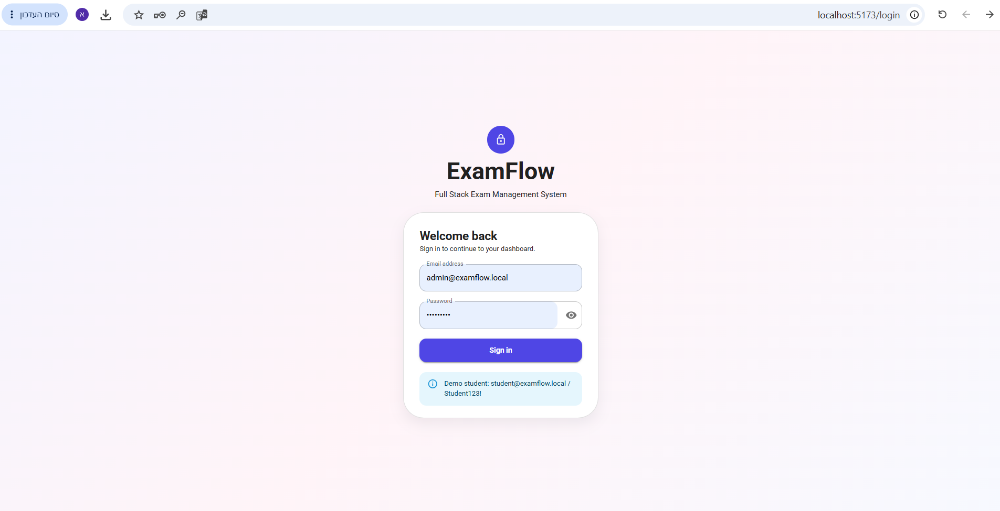
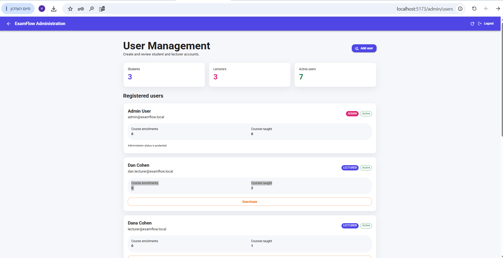
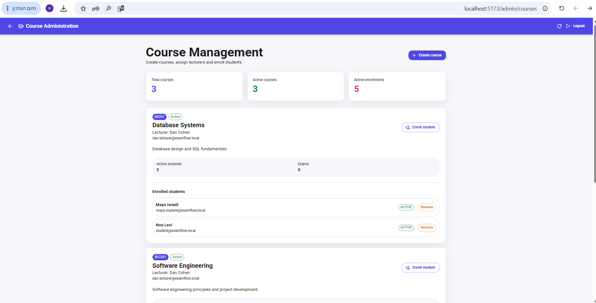
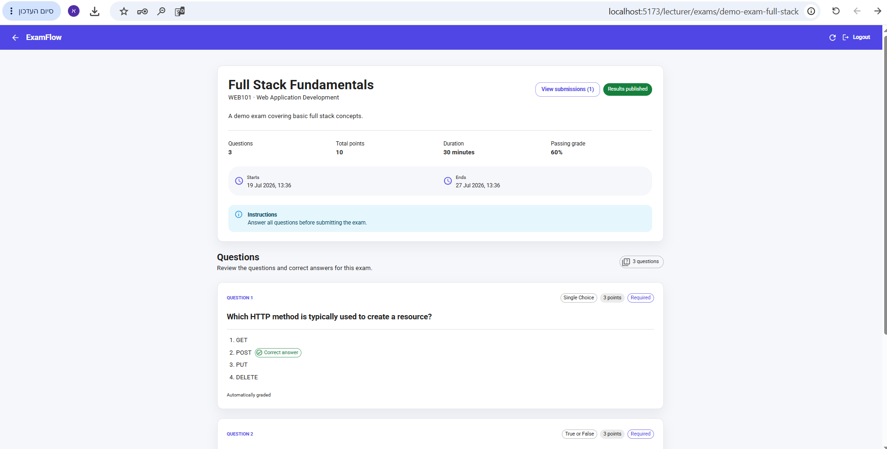
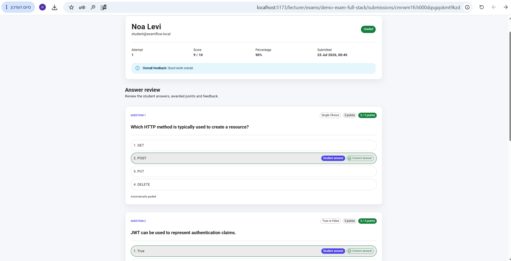
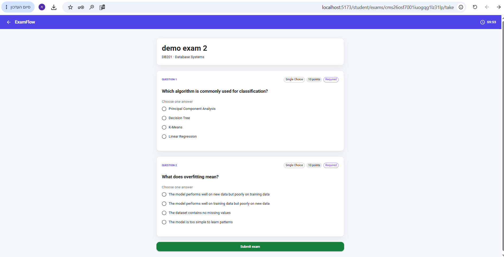
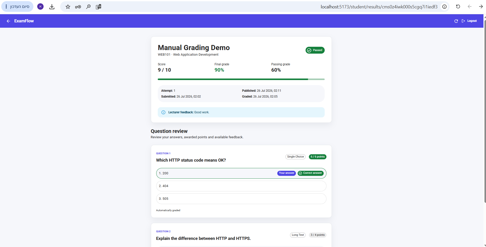

# ExamFlow — Exam Management System

[](https://github.com/OranitPeretz/exam-management-system/actions/workflows/ci.yml)

ExamFlow is a full-stack academic exam management system that supports the complete examination lifecycle: academic administration, exam creation, student submissions, grading and result publication.

## Main Features

### Administrator

- Create student and lecturer accounts
- Activate and deactivate users
- Create and manage courses
- Assign lecturers to courses
- Enroll students in courses
- Remove students from courses
- Control access through role-based authorization

### Lecturer

- Create, update and delete draft exams
- Add, edit and delete exam questions
- Configure question types, points and correct answers
- Publish exams
- Review student submissions
- Automatically grade supported question types
- Manually grade written answers
- Add question-specific and overall feedback
- Publish final results to students

### Student

- View exams available through course enrollment
- Start or resume an exam attempt
- Answer multiple-choice, true-or-false and written questions
- Automatically save answers during the exam
- Submit an exam
- View published grades and lecturer feedback
- Review answers and awarded points after result publication

## Application Screenshots

### Authentication

Users access the system through the secure login page.



### Academic Administration

Administrators can create and manage student and lecturer accounts.



Administrators can manage courses, lecturer assignments and student enrollments.



### Lecturer Exam Management

Lecturers can create exams, configure questions and publish exams to enrolled students.



Lecturers can review student answers, award points and provide feedback.



### Student Examination

Students can take available exams while their answers are saved securely.



After the lecturer publishes the results, students can review their grades, answers and feedback.



## Technology Stack

| Layer | Technologies |
|---|---|
| Frontend | React, TypeScript, Vite, Material UI, TanStack Query |
| Backend | Node.js, Express, TypeScript |
| Database | PostgreSQL, Neon |
| ORM | Prisma |
| Authentication | JWT, secure cookies, role-based authorization |
| Validation | Zod |
| Testing | Vitest, Supertest, Testing Library, jsdom |
| Security | Helmet, authentication middleware, authorization guards |
| CI | GitHub Actions |

## Project Structure

```text
exam-management-system/
├── .github/
│   └── workflows/
│       └── ci.yml
├── client/
│   ├── src/
│   │   ├── features/
│   │   ├── pages/
│   │   ├── routes/
│   │   └── test/
│   └── package.json
├── server/
│   ├── prisma/
│   ├── src/
│   │   ├── config/
│   │   ├── database/
│   │   ├── middleware/
│   │   └── modules/
│   ├── tests/
│   ├── .env.example
│   └── package.json
└── README.md
```

## Prerequisites

Install the following before running the project:

- Node.js 22 or later
- npm
- PostgreSQL database or a Neon PostgreSQL project
- Git

## Local Installation

Clone the repository:

```bash
git clone https://github.com/OranitPeretz/exam-management-system.git
cd exam-management-system
```

### Server Setup

Move into the server directory and install dependencies:

```bash
cd server
npm ci
```

Create a local environment file:

```cmd
copy .env.example .env
```

Update `server/.env` with your own PostgreSQL connection strings and JWT secret.

Never commit the `.env` file or expose database credentials.

Generate a strong JWT secret locally:

```bash
node -e "console.log(require('crypto').randomBytes(64).toString('hex'))"
```

Generate the Prisma Client, apply the database migrations and seed the development data:

```bash
npm run db:generate
npm run db:migrate
npm run db:seed
```

Start the API:

```bash
npm run dev
```

The API runs at:

```text
http://localhost:4000
```

### Client Setup

Open another terminal:

```bash
cd client
npm ci
npm run dev
```

The application runs at:

```text
http://localhost:5173
```

## Environment Configuration

The server uses the following environment variables:

| Variable | Purpose |
|---|---|
| `NODE_ENV` | Application environment |
| `PORT` | API port |
| `CLIENT_URL` | Allowed frontend origin |
| `DATABASE_URL` | Pooled PostgreSQL connection |
| `DIRECT_URL` | Direct PostgreSQL connection for migrations |
| `JWT_ACCESS_SECRET` | Secret used to sign access tokens |
| `JWT_ACCESS_EXPIRES_IN` | Access-token expiration time |
| `AUTH_COOKIE_NAME` | Authentication cookie name |
| `AUTH_COOKIE_MAX_AGE_SECONDS` | Authentication cookie lifetime |

Use `server/.env.example` as the configuration template. It must contain placeholders only and never real credentials.

## Development Accounts

The database seed creates the following development-only accounts:

| Role | Email | Password |
|---|---|---|
| Administrator | `admin@examflow.local` | `Admin123!` |
| Lecturer | `lecturer@examflow.local` | `Lecturer123!` |
| Student | `student@examflow.local` | `Student123!` |

These credentials are intended only for local development and demonstration. They must be replaced before a production deployment.

## Available Commands

### Server

Run commands from the `server` directory:

| Command | Description |
|---|---|
| `npm run dev` | Start the API in development mode |
| `npm run typecheck` | Run TypeScript type checking |
| `npm run build` | Generate Prisma Client and compile the server |
| `npm test` | Run the server test suite |
| `npm run test:coverage` | Run tests with coverage |
| `npm run db:generate` | Generate Prisma Client |
| `npm run db:migrate` | Apply database migrations |
| `npm run db:seed` | Seed development data |

### Client

Run commands from the `client` directory:

| Command | Description |
|---|---|
| `npm run dev` | Start the Vite development server |
| `npm run lint` | Run ESLint |
| `npm run build` | Type-check and build the client |
| `npm test` | Run the client test suite |
| `npm run test:coverage` | Run client tests with coverage |

## Testing

The automated test suites currently cover:

- API security boundaries
- Authentication
- Authorization and role restrictions
- Administrator APIs
- Lecturer exam management
- Student exam workflows
- Submission, grading and result publication
- Login-page behavior
- Authentication provider behavior
- Protected and role-based routes
- Role-based dashboard behavior

Run all server checks:

```bash
cd server
npm test
npm run test:coverage
npm run typecheck
npm run build
```

Run all client checks:

```bash
cd client
npm test
npm run test:coverage
npm run lint
npm run build
```

## Continuous Integration

GitHub Actions runs separate server and client jobs for every push and pull request to `main`.

The CI workflow performs:

### Server checks

1. Install dependencies
2. Generate Prisma Client
3. Run automated tests
4. Run TypeScript type checking
5. Build the server

### Client checks

1. Install dependencies
2. Run automated tests
3. Run ESLint
4. Build the production client

The workflow uses placeholder test configuration and does not contain real database credentials.

## Security Considerations

- Passwords are stored as hashes
- Protected API routes require authentication
- Role-based middleware restricts access by user role
- Inactive users cannot log in
- Users cannot deactivate their own administrator account
- Exam answers and grading configuration are hidden from students during active attempts
- Results are available to students only after lecturer publication
- Request bodies are validated before reaching application services
- Helmet adds common HTTP security headers
- Sensitive environment files are excluded from Git

## Main Workflow

1. An administrator creates users and courses.
2. The administrator assigns lecturers and enrolls students.
3. A lecturer creates an exam and adds questions.
4. The lecturer publishes the exam.
5. An enrolled student starts and submits an attempt.
6. Supported questions are graded automatically.
7. The lecturer reviews written answers and completes grading.
8. The lecturer publishes the results.
9. The student reviews the final grade and feedback.

## Project Status

The main functional requirements are implemented, tested and protected by continuous integration.

The remaining work focuses on final documentation, screenshots, deployment preparation and presentation material.